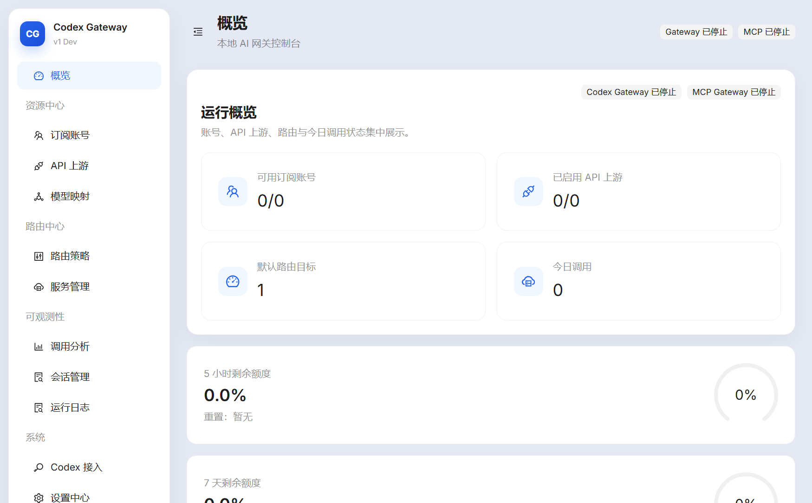

# Codex Gateway

[中文文档](README_zh.md)

## What This Project Is

Codex Gateway is a Windows desktop app for using ChatGPT subscription accounts and third-party model channels from Codex in one place.



## Why Use It

- Switch between subscription and third-party models from the Codex model picker.
- View account quotas, channel balances, request usage, latency, and estimated cost.
- Keep account and channel configuration in a local `data/` directory beside the app.
- Manage the local API service and optional MCP service from one interface.

## Quick Start

1. Open `Codex Gateway.exe`.
2. Add a ChatGPT subscription account, a model channel, or both.
3. Open **Integration Mode** and apply Gateway mode.
4. Start the API service from **Services**.
5. Return to Codex and select a model.

Gateway mode makes subscription and third-party models available together. Account mode connects Codex directly to one selected subscription account.

## Reference

### Subscription Accounts

Sign in through the browser or import the account currently used by Codex. You can view quota and reset-credit status, refresh an account, enable or disable it, use an available reset credit, or remove the account.

### Model Channels

Each Responses API channel supports the following settings:

- Channel name, API address, API key, and enabled state.
- Provider-supplied Codex `models.json`; model IDs must be unique across channels.
- WebSocket support. Leave it off when the provider supports HTTP only.
- Remote compaction adaptation. Keep it enabled unless the provider explicitly supports native Codex compaction.
- Optional balance lookup, public or encrypted request headers, and per-model input, cached-input, and output prices.

You can inspect the imported model catalog and test a channel before using it in Codex.

The **Integration Mode** page applies either gateway or direct-account mode to Codex. Gateway mode also lets you choose the recommended Base URL configuration or a custom Provider configuration before applying it.

### Services

The **Services** page starts, stops, and restarts the local API service and the optional MCP service powered by [`mcp-gateway-service`](https://github.com/jadchene/mcp-gateway). Configure the MCP service file path and address before starting it.

### Settings

| Area | Available settings |
| --- | --- |
| General | Launch with Windows, window-close behavior, theme, and interface density. |
| Local gateway | Listening address, port, local API key, and automatic service start. |
| MCP integration | Automatic start, configuration file path, host, port, and HTTP path. |
| Accounts and quotas | Refresh interval, refresh timeout, account-selection policy, quota cooldown, quota display, and an optional third-party fallback model for auto review. |
| Logs and billing | Request-log retention, runtime-log retention, and billing currency. |
| Storage | Current data location and controls for clearing request or runtime logs. |
| Advanced network | Connection and idle timeouts, request timeout, shutdown grace period, HTTP and WebSocket limits, payload and buffer limits, and automatic HTTP fallback for HTTP-only models. Defaults are suitable for normal use. |

Some service settings take effect after the corresponding service is restarted.

### Data and Backup

Packaged application data is stored in `data/` beside the app. Back up this directory before moving or replacing the application. Do not share it because it contains account and channel configuration.

This project is intended for personal local use. Use your own accounts and API keys, and follow each provider's terms.

## Development

Node.js 24 or newer is required.

```bash
npm install
npm run dev
npm run verify
```

Create the Windows unpacked build with:

```bash
npm run pack:unpacked
```

The output is `release/win-unpacked/Codex Gateway.exe`. It is not code-signed and does not include an installer.

## License

MIT. See [LICENSE](LICENSE).
